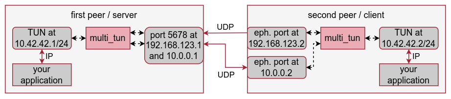

# multi_tun

Multi-connectivity tunnel: connect two peers via multiple network paths in parallel to lower latency and increase reliability.

### Description

multi_tun connects two peers by opening a TUN device on each peer and bridging between the two via multiple UDP paths.
The first (server) peer listens on a UDP port, the second peer (client) specifies any number of endpoints where the server can be reached.
All raw IP packets between the TUN devices are encapsulated in UDP and sent via all network paths in parallel.

Note:
- only one client per server (i.e., two connected peers) is supported.
- all packets are sent via all network paths, so this software does multiply the used bandwidth to provide lower latency and increased reliability.
- the software needs CAP_NET_ADMIN or root rights to open a TUN device.

### Example



The server/first peer creates a TUN device at 10.42.42.1 and listens on UDP port 5678 for incoming packets:

```sh
$ sudo multi_tun -l 10.42.42.1 -s 0.0.0.0 -p 5678
```

The client/second peer creates a TUN device at 10.42.42.2 and connects to the server at 192.168.123.1 and 10.0.0.1 while binding to .2 on both interfaces:

```sh
$ sudo multi_tun -l 10.42.42.2 -c 192.168.123.2:192.168.123.1,10.0.0.2:10.0.0.1 -p 5678
```

Now the server and client can reach each other by binding on their own TUN address and connecting to the other TUN address.

### License

Apache License 2.0
